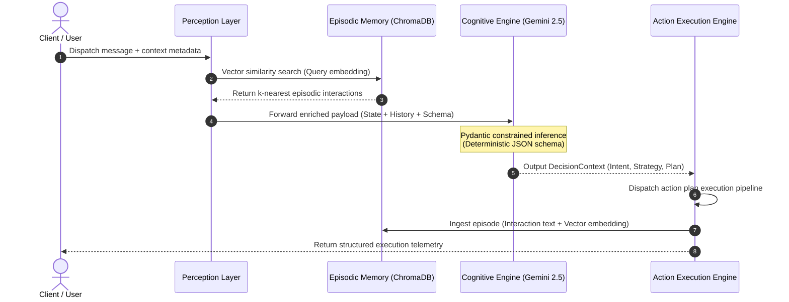
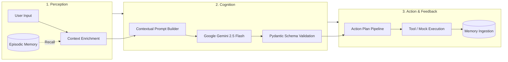

## Architecture Overview

The system models autonomous behavior through a cyclic cognitive loop. Rather than treating queries as stateless text exchanges, the agent captures contextual signals, retrieves relevant historical embeddings, performs constrained reasoning via schema-enforced JSON generation, executes targeted actions, and indexes the outcome for long-term memory continuity.

### Cognitive Loop Sequence



---

## Core Cognitive Primitives


---

## 🧩 Architectural Deep Dive

### 1. Perception & Historical Recall Layer
The perception component intercepts unconditioned inputs and contextualizes them against operational parameters:
* **Context Normalization:** Ingests user metadata, SLA tiering (`standard`, `premium`), and system health telemetry.
* **Vector Semantic Retrieval:** Executes a $k$-nearest neighbor search across previous interaction embeddings stored in ChromaDB, retrieving relevant historical episodes without loading entire conversation logs into the active context window.

### 2. Cognition & Strategic Reasoning Engine
Driven by **Google Gemini 2.5 Flash**, the cognitive module implements constrained reasoning:
* **Pydantic Schema Enforcement:** Guarantees strict JSON output compliance with the `DecisionContext` schema, eliminating output hallucinations and formatting drift.
* **Dynamic Strategy Selection:** Computes optimal remediation paths (`full_autonomous_resolution`, `guided_resolution`, `immediate_escalation`) based on issue persistence, SLA priority, and available runtime tools.

### 3. Execution Pipeline & State Ingestion
Translates structured decision payloads into concrete operational tasks:
* **Deterministic Execution:** Iterates over the structured `action_plan` and dispatches tasks to API endpoints or internal tool handlers.
* **Memory Consolidation:** Automatically vectorizes and persists the tuple `(User Query, Strategy, Execution Logs)` into ChromaDB, closing the cognitive loop for subsequent interactions.

---

## 📂 Repository Structure

```text
autonomous-decision-agent/
├── .github/
│   └── workflows/
│       └── ci.yml               # Automated CI/CD (Pytest & linting pipelines)
├── src/
│   ├── __init__.py
│   ├── agent.py                 # Core Agent architecture (Perception, Cognition, Action, Memory)
│   └── config.py                # Environment configuration & model hyperparameters
├── tests/
│   ├── __init__.py
│   └── test_agent.py            # Unit test suite with mock fixtures
├── .env.example                 # Environment variables template
├── .gitignore                   # Git exclusion rules
├── main.py                      # Production entrypoint simulating multi-turn state drift
├── requirements.txt             # Production & development dependencies
└── README.md                    # Technical documentation
```

---

## ⚙️ Technical Specifications

| Component | Technology / Library | Functional Role |
| :--- | :--- | :--- |
| **Runtime** | Python 3.10+ / 3.11 | System runtime environment |
| **Core LLM** | Google Gemini `gemini-2.5-flash` | Intent classification, structured reasoning, and action planning |
| **Schema Validation** | `pydantic>=2.0.0` | Enforces deterministic, typed output contracts |
| **Vector Database** | `chromadb>=0.4.0` | Embedded vector indexing for episodic memory retrieval |
| **Test Framework** | `pytest>=8.0.0` | Automated unit testing and contract verification |
| **CI/CD Pipeline** | GitHub Actions | Automated build, dependency caching, and test execution |

---

## 🚀 Getting Started

### Prerequisites

* Python `3.10` or higher installed.
* An active Google AI Studio API key (`GEMINI_API_KEY`).

### Installation & Local Setup

1. **Clone the repository:**
   ```bash
   git clone [https://github.com/YOUR_USERNAME/autonomous-decision-agent.git](https://github.com/YOUR_USERNAME/autonomous-decision-agent.git)
   cd autonomous-decision-agent
   ```

2. **Initialize and activate virtual environment:**
   ```bash
   python -m venv .venv
   source .venv/bin/activate  # On Windows: .venv\Scripts\Activate.ps1
   ```

3. **Install project dependencies:**
   ```bash
   pip install --upgrade pip
   pip install -r requirements.txt
   ```

4. **Configure environment variables:**
   ```bash
   cp .env.example .env
   ```
   Add your Google API key to `.env`:
   ```ini
   GEMINI_API_KEY="your_actual_gemini_api_key_here"
   ```

---

## 🧪 Testing & Execution

### 1. Execute Multi-Turn Adaptive Agent

Run the main orchestration script to simulate a multi-turn interaction showing automatic strategy escalation based on episodic memory retrieval:

```bash
python main.py
```

### 2. Run Test Suite

Execute unit tests with mocked Google API and ChromaDB boundaries:

```bash
python -m pytest tests/ -v
```

---

## 🔄 CI/CD Pipeline

A production-ready GitHub Actions workflow is configured in `.github/workflows/ci.yml`. On every `push` and `pull_request` to the `main` branch, the pipeline:
1. Provisions an isolated Ubuntu container.
2. Configures the Python 3.11 runtime environment.
3. Installs and caches dependencies via `pip`.
4. Executes the full `pytest` suite to ensure architectural integrity.

---

## 📄 License

Distributed under the MIT License. See `LICENSE` for more information.
