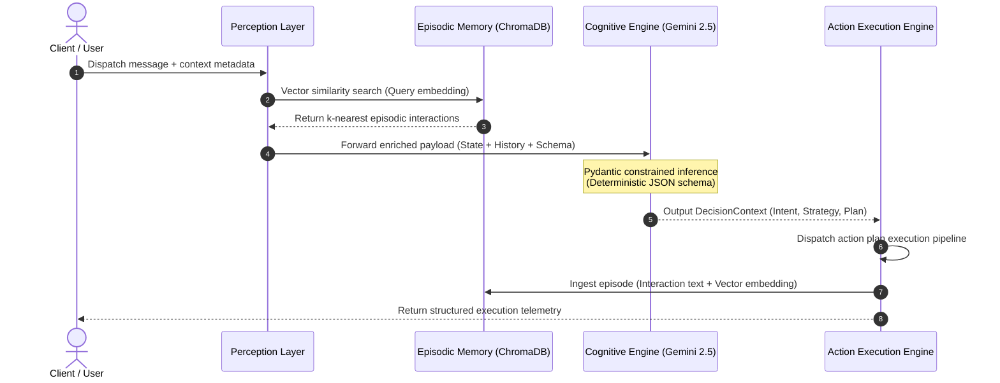
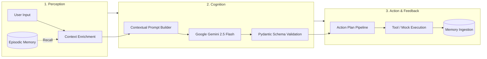

## Architecture Overview

The system models autonomous behavior through a cyclic cognitive loop. Rather than treating queries as stateless text exchanges, the agent captures contextual signals, retrieves relevant historical embeddings, performs constrained reasoning via schema-enforced JSON generation, executes targeted actions, and indexes the outcome for long-term memory continuity.

### Cognitive Loop Sequence

---

## Core Cognitive Primitives

